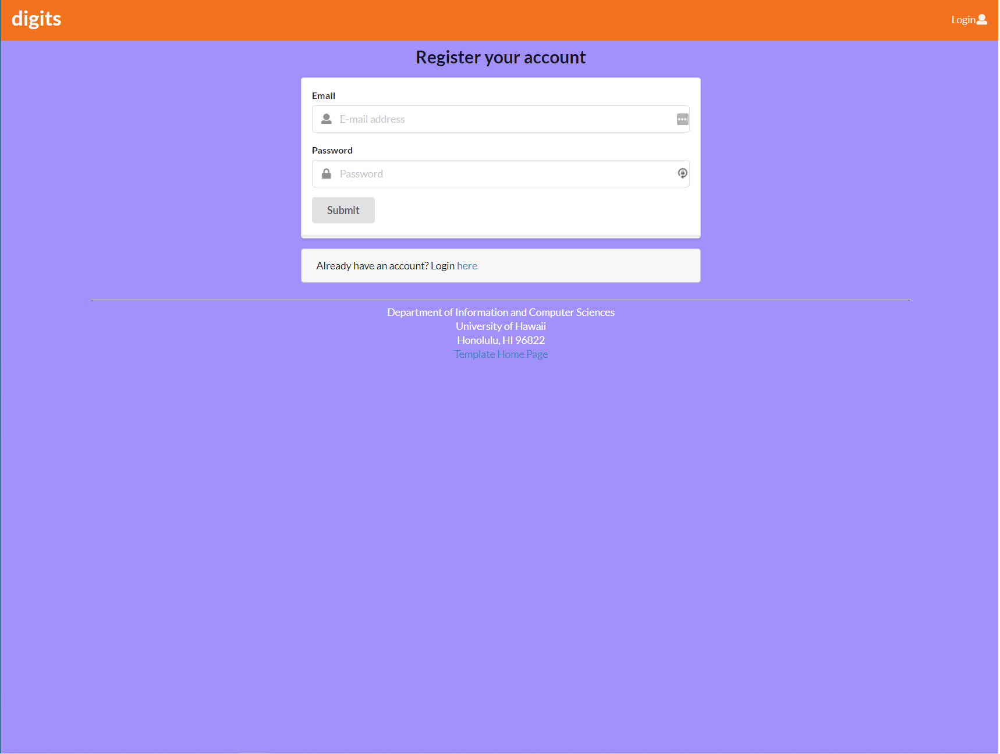
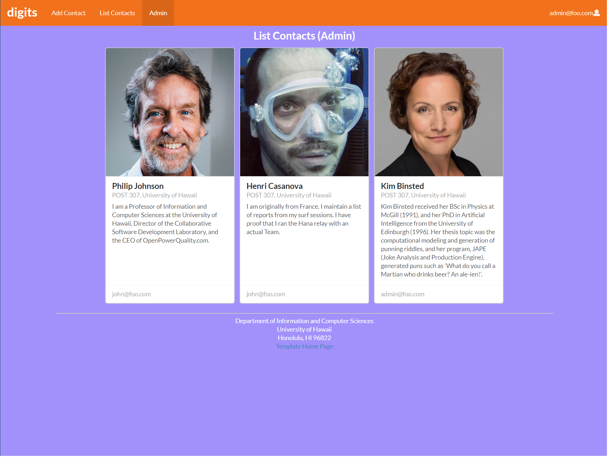

## Table of Contents
* [Overview](#overview)
* [User Installation Guide](#user-installation-guide)
* [Website Tour](#website-tour)


## Overview
Digits is an application that allows the user to register an account, and manage a set of contacts. The user will be able to add and edit different contacts, as well as add different timestamped notes to each contact.

## User Installation Guide
First, you need to install [Meteor](https://www.meteor.com/developers/install). After installing Meteor, you will need to [download a copy of Digits](https://github.com/jon-valencia/digits) by request access to the private Digits repository.

After downloading the Digits repository to your computer, open a terminal/command prompt/PowerShell in the `app` directory and invoke `npm install` to install the required libraries and `meteor npm run start` to start the Digits web application.

On the first start up the applicaiton will be initialized with a few default accounts and contacts. Your terminal/command prompt/PowerShell should look a little like this:
```
PS C:\Users\jvale\Documents\GitHub\digits\app> meteor npm run start

> meteor-application-template-react@ start C:\Users\jvale\Documents\GitHub\digits\app
> meteor --no-release-check --exclude-archs web.browser.legacy,web.cordova --settings ../config/settings.development.json

[[[[[ C:\Users\jvale\Documents\GitHub\digits\app ]]]]]

=> Started proxy.
=> Started MongoDB.
I20211109-21:17:35.623(-10)? Creating the default user(s)
I20211109-21:17:35.625(-10)?   Creating user admin@foo.com.
I20211109-21:17:35.690(-10)?   Creating user john@foo.com.
I20211109-21:17:35.749(-10)? Creating default Contacts.
I20211109-21:17:35.750(-10)?   Adding: Johnson (john@foo.com)
I20211109-21:17:35.760(-10)?   Adding: Casanova (john@foo.com)
I20211109-21:17:35.761(-10)?   Adding: Binsted (admin@foo.com)
I20211109-21:17:35.784(-10)? Monti APM: completed instrumenting the app
=> Started your app.

=> App running at: http://localhost:3000/
   Type Control-C twice to stop.
   ```

Assuming all installation steps were followed properly, the Digits web application should be available to use at [http://localhost:3000](http://localhost:3000). By default there will be two accounts already created, both accounts' email and password can be found in [settings.development.json](app/config/settings.development.json)

## Website Tour
### Landing Page
Upon loading Digits, you will be greeted with this page giving you a brief overview of Digits' capabilities.


### Login Page
From the Landing page you'll be able to click the button on the top right which will bring you to the Login page.


### Register Page
If you don't have an account in Digits, you'll be able to register your account by clicking on the register link in Login page.



### User Landing Page
After logging in to your account, you will be brought to a page very similar to the Landing page, except here you will see that the NavBar has two new options, "Add Contact" and "List Contacts"


### Add Contact Page
This page is pretty straightforward, it'll allow you to add contacts to your account.


### List Contacts
This page will list the contacts that you've added to your account as well as show any timestamped notes you've made about each contact. Each contact card has a button that'll allow you to edit the contact's info.


### Admin mode
The admin mode retrieves all contact information and shows who each contact is associated with. By default there is one admin account, with possibility to designate more users with the role.


